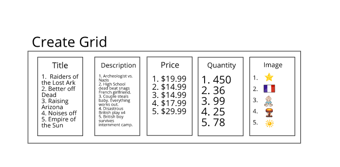

# Catalogulous
## A movie catalogue proof of concept exercise for ALLMOXY
### by Thomas Glenn

# About this project
The parameters of this project were the following:

- Build a small product grid. With the following columns:
Title, Description, Price, Quantity, Image
- The grid should be sortable and allow the user to add/edit products. 
- There should be 5 sample entries and be publicly accessible so I can test it out. 
- We also need to be able to see the code.

# Technologies used: 
 - JavaScript, JSX, React, Redux, ReactDOM, Yarn, Visual Studio Code, json-server, Semantic-ui

 # To Run This Application:
  1. Clone from repository using command: 
    $ `git clone https://github.com/thomasglenngit/allmoxy-grid`
  2. Open downloaded file using preferred code editor.
  3. Once file opened, create 2 terminals.
  4. In first terminal go to the directory:
    $ `cd allmoxy-grid/server`
  5. Once in the "server" directory type:
    $ `yarn start`  This will start the local server holding the data on localhost:3001.
  6. On the second terminal, go to the directory:
    $ `cd allmoxy-grid/client`
  7. Once in the "client" directory type:
    $ `yarn start` This will run the application in the browser on `http://localhost:3000/`

# BUGS:

1. At this point, JSON-server requires that the user <b>REFRESH THE PAGE</b> after every click to effectuate the event. It's a pain right now, but I can figure it out.
(ex. click on 'edit', => blank page, click 'refresh page' => edit page)
2. I attempted to handle sorting the database entries (movies list) programmatically, using reducers and actions. It sorts the list, but then adds it to the existing list. My work-around was to clear state via conditionals in the reducers/index.js (I've left this there, coded-out), which works, but also disables the form functions. I'm close on this one, but in retrospect, I should have handled sorting functionally, rather than programmatically.
3. My intention was to hook-up an image api to generate images into that category, but I have run out of the time I alotted myself. 

